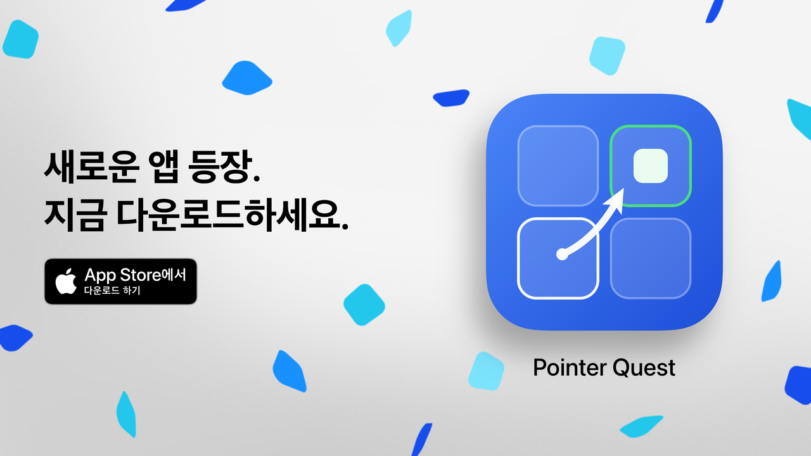
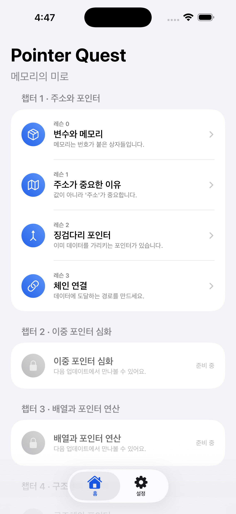
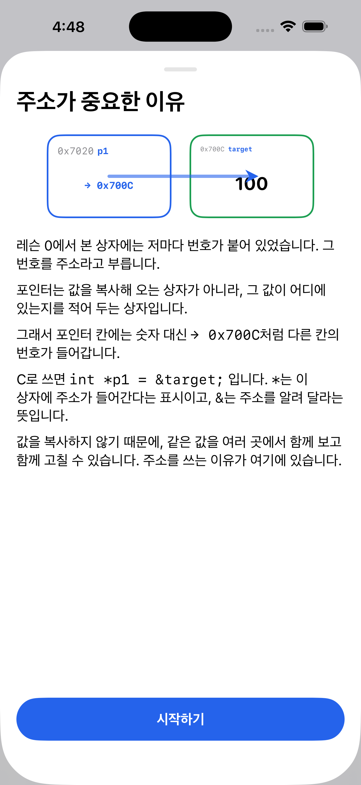
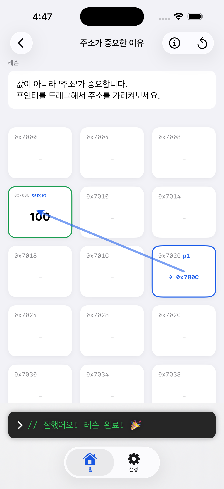
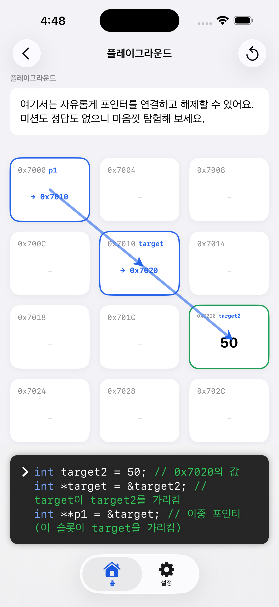
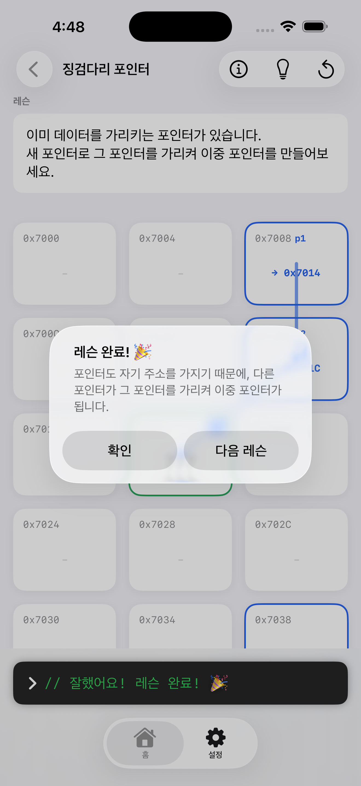

<div align="center">
  <a href="https://apps.apple.com/kr/app/pointer-quest/id6810896765">
    
  </a>

  # Pointer Quest
  **포인터를 눈으로 배우는 법**

  C 언어의 포인터·메모리 개념을 드래그 인터랙션으로 체득시키는 iOS 학습 시뮬레이터

  [](https://www.apple.com/ios/)
  [](https://swift.org)
  [](https://developer.apple.com/xcode/swiftui/)
  [](#기술-스택)

  <a href="https://apps.apple.com/kr/app/pointer-quest/id6810896765">
    
  </a>

  

  <sub>카메라로 QR 코드를 스캔하면 App Store로 바로 이동합니다</sub>
</div>

## 소개
포인터는 C를 배우는 사람이 가장 먼저 막히는 벽입니다. 문법은 외웠는데 메모리에서 무슨 일이 일어나는지 그려지지 않기 때문입니다.

Pointer Quest는 메모리를 16칸 격자로 펼쳐 놓고, **손으로 만지는 시뮬레이션**으로 그 추상성을 걷어냅니다. 칸마다 주소가 붙어 있고, 값이 든 칸과 주소가 든 칸은 생김새가 다릅니다.

### 3단 학습 루프
이 앱의 핵심은 다음 세 단계가 한 화면에서 동시에 일어난다는 점입니다.

1. **체득** — 블록을 드래그해 다른 칸에 떨어뜨리면서 "가리킨다"는 동작을 몸으로 익힙니다
2. **코드 연결** — 그 조작이 즉시 `int *p1 = &target;` 형태의 C 코드로 하단 코드 패널에 나타납니다
3. **시각 확인** — 화살표 애니메이션이 그려져 "무엇이 무엇을 가리키는가"를 눈으로 다시 확인합니다

### 배경
원래 Swift Student Challenge 2026 제출용 "게임" 포맷으로 만들었습니다(태그 `Swift-Student-Challenge-2026`). 수상하지 못한 뒤 목표를 App Store 출시로 바꾸면서, Mission·Level Clear 같은 게임 프레이밍을 걷어내고 **인터랙티브 학습 도구**로 리포지셔닝했습니다. XP·스트릭·리더보드는 의도적으로 넣지 않았습니다. 학습이라는 본질에서 주의를 분산시키지 않기 위해서입니다.

`1.0.0`은 2026년 9월 15일 App Store 심사를 통과해 출시됐습니다.

## 스크린샷
| 레슨 목록 | 개념 카드 | 포인터 연결 | 플레이그라운드 | 레슨 완료 |
|:---:|:---:|:---:|:---:|:---:|
|  |  |  |  |  |

## 주요 기능
### 메모리 그리드
- **4×4 16칸 격자** — 각 칸에 `0x7000`부터 4바이트 간격의 주소가 붙습니다
- **드래그로 포인터 연결** — `.draggable` / `.dropDestination`으로 칸을 끌어다 연결합니다. 빈 칸에 떨어뜨리면 값과 변수명이 자동으로 생성됩니다
- **탭으로 값 확인** — 칸을 누르면 그 칸의 정보가 C 코드로 코드 패널에 출력됩니다
- **더블 탭 역참조(`*`)** — 포인터가 아닌 칸에 시도하면 빨간 배경과 흔들림(`ShakeEffect`)으로 왜 안 되는지 알려줍니다
- **화살표 오버레이** — 참조 관계를 실선 화살표로 그려 체인 구조가 한눈에 보입니다

### 학습 흐름
- **개념 카드** — 레슨에 처음 들어가면 도식 한 장과 3~5문장으로 핵심을 먼저 잡아줍니다
- **챕터 1 · 주소와 포인터** — 레슨 4개
  - 레슨 0 변수와 메모리 — 변수는 이름표가 붙은 상자이고, 상자마다 번호가 있습니다
  - 레슨 1 주소가 중요한 이유 — 값이 아니라 주소를 다루면 무엇이 달라지는지 봅니다
  - 레슨 2 징검다리 포인터 — 포인터도 자기 주소를 가지므로 다른 포인터가 가리킬 수 있습니다
  - 레슨 3 체인 연결 — 주소를 이어 붙여 데이터에 도달하는 경로를 만듭니다
- **완료 피드백** — 레슨을 마치면 완성된 코드 전체가 코드 패널에 남고, 그 아래 축하 주석이 붙습니다. "이번에 배운 것"이 한 문장으로 정리됩니다
- **플레이그라운드** — 성공 조건이 없는 샌드박스입니다. 자유롭게 연결하고 끊어볼 수 있습니다
- **진행 상황** — 완료한 레슨에 체크마크가 붙습니다. 기기에만 저장됩니다

### 그 외
- **한국어 · 영어 지원** — String Catalog 기반. UI 문구뿐 아니라 **C 코드 주석까지 번역 대상**입니다
- **다크 모드** — 모든 색 자산에 다크 변형이 정의돼 있습니다
- **접근성** — 색에만 의존하지 않는 표기(형태·`→` 접두어·접근성 레이블), Dynamic Type 대응
- **온보딩** — 첫 실행 시 튜토리얼을 제공하고, 이후 설정에서 다시 볼 수 있습니다

## 기술 스택
| 항목 | 내용 |
|---|---|
| 언어 | Swift 6.0 |
| UI | SwiftUI 100% (Storyboard·XIB 없음) |
| 아키텍처 | MVVM (`ObservableObject` + `@Published`, `@MainActor`) |
| 영속화 | `UserDefaults` (`LessonProgressStore`) |
| 로컬라이제이션 | String Catalog (`Localizable.xcstrings`), 소스 언어 한국어 / 키 98개 |
| 프로젝트 정의 | XcodeGen (`project.yml`) |
| 서드파티 의존성 | **없음** — SPM·CocoaPods 모두 0개 |
| 네트워크 | **없음** — 수집하는 데이터 0, 광고 0 |

## 아키텍처에서 눈여겨볼 점
### 선언형 레슨 블루프린트
레슨의 초기 배치(`SlotSeed`)와 성공 조건이 **데이터**로 표현됩니다. 성공 조건은 `SuccessCondition` enum으로 추상화돼 있습니다.

```swift
enum SuccessCondition: Hashable {
  case anyPointerPointsTo(index: Int) // 해당 칸을 가리키는 포인터가 생기면 클리어
  case chain(indices: [Int])          // 지정한 순서의 참조 체인이 완성되면 클리어
  case inspectedAll(indices: [Int])   // 지정한 칸을 모두 탭해 확인하면 클리어
  case sandbox                        // 조건 없음
}
```

덕분에 새 레슨을 추가할 때 뷰모델 로직을 건드리지 않고 [Lesson.swift](PointerQuest/Core/Lesson.swift)에 데이터만 선언하면 됩니다. 원래는 레슨별 분기가 뷰모델 `switch` 문에 하드코딩돼 있었고, 콘텐츠를 늘릴 때마다 로직 코드를 계속 수정해야 했습니다. 이를 걷어낸 것이 리포지셔닝 작업의 핵심이었습니다.

### Preference 기반 화살표 레이어
칸의 좌표를 `anchorPreference`로 수집하고 `overlayPreferenceValue`로 한 번에 넘겨, [ArrowDrawLayer.swift](PointerQuest/Scene/Quest/Entity/ArrowDrawLayer.swift)가 모든 화살표를 한 곳에서 그립니다. 각 칸이 자기 이웃의 위치를 알 필요가 없어, 레이아웃과 그리기가 분리됩니다.

### 도식의 단일 출처
개념 카드의 설명 그림을 별도 일러스트로 그리지 않고, 실제 화면에 쓰이는 `MemorySlotView`·`PointerArrow` 컴포넌트를 그대로 조립해 만듭니다. 앱 화면과 설명 그림이 구조적으로 어긋날 수 없습니다.

### 디자인 규칙의 문서화
색·화살표·배지가 각각 무엇을 의미하는지를 [VISUAL_LANGUAGE.md](VISUAL_LANGUAGE.md)에, SwiftUI 코딩 관례를 [STYLE_GUIDE.md](STYLE_GUIDE.md)에 고정해 두었습니다. 표기가 "종류"를 뜻하는지 "상태"를 뜻하는지를 두 축으로 나눠 관리합니다.

## 요구 버전
| 항목 | 값 |
|---|---|
| 최소 iOS | 16.0 |
| 빌드에 사용한 Xcode | 26.6 (iOS 26.5 SDK) |
| Swift | 6.0 |
| 지원 기기 | iPhone 전용 · 세로 방향 전용 |
| 현재 버전 | `1.0` (빌드 `1`) |

Mac Catalyst와 Vision Pro는 레이아웃을 검증한 적이 없어 `project.yml`에서 명시적으로 차단했습니다.

## 빌드
공유 스킴이 커밋돼 있어 클론 직후 바로 열립니다.

```bash
git clone https://github.com/yuminc03/pointer-quest.git
cd pointer-quest
open PointerQuest.xcodeproj
```

- **XcodeGen 설치는 필요하지 않습니다.** `project.pbxproj`가 저장소에 포함돼 있습니다. `project.yml`은 빌드 설정의 참조 원본으로만 둡니다
- 이 저장소는 **`project.pbxproj`를 재생성하지 않는 것을 규칙**으로 합니다. 재생성하면 파일 참조 UUID가 전부 바뀌어 diff를 읽을 수 없게 됩니다. 설정을 바꿀 때는 `project.yml`과 `project.pbxproj` 양쪽의 값을 맞춥니다
- 실기기에 설치하려면 `DEVELOPMENT_TEAM`을 본인 팀 ID로 바꿔야 합니다

명령줄 빌드는 다음과 같습니다.

```bash
xcodebuild -scheme PointerQuest -destination 'platform=iOS Simulator,name=iPhone 17 Pro' build
```

## 프로젝트 구조
```
PointerQuest/
├── App/                  # 진입점, 탭 구성, 앱 언어
│   ├── MyApp.swift
│   ├── AppView.swift
│   └── AppLanguage.swift
├── Core/                 # 모델과 저장소 (뷰 의존성 없음)
│   ├── Lesson.swift              # 챕터·레슨·블루프린트·성공 조건
│   ├── LessonProgressStore.swift # UserDefaults 진행 상황
│   └── MemorySlot.swift          # 메모리 한 칸의 상태
├── DesignSystem/
│   ├── Animation/        # ShakeEffect
│   ├── Component/        # MemorySlotView, PointerArrow, CCodeHighlighter 등
│   ├── UI/
│   ├── Colors.xcassets/  # 색 토큰 9종 + AppIcon
│   └── Images.xcassets/  # 온보딩·환영 이미지
└── Scene/                # 화면 단위. 각 화면의 하위 뷰는 Entity/에 둔다
    ├── Main/             # 레슨 목록
    ├── Quest/            # 메모리 그리드 (앱의 핵심 화면)
    ├── Setting/          # 설정, 온보딩
    └── Welcome/          # 첫 실행 환영 화면
```

## 문서
이 저장소는 작업 과정을 문서로 남깁니다.

| 문서 | 내용 |
|---|---|
| [HANDOFF.md](HANDOFF.md) | 작업 재개용 최신 스냅샷. 현재 상태와 실전 주의사항 |
| [PROPOSAL.md](PROPOSAL.md) | 앱 정체성과 포지셔닝 |
| [PLAN.md](PLAN.md) | 설계 결정과 그 근거 |
| [TODO.md](TODO.md) | Task별 체크리스트 (정본) |
| [PROGRESS.md](PROGRESS.md) | Task별 진행·검증 기록 |
| [STYLE_GUIDE.md](STYLE_GUIDE.md) | SwiftUI 코딩 관례 |
| [VISUAL_LANGUAGE.md](VISUAL_LANGUAGE.md) | 색·도식 표기 규칙 |
| [docs/app-store-connect.md](docs/app-store-connect.md) | App Store 등록 정보와 스크린샷 규격 |

스토어 스크린샷 원본은 [docs/screenshots/](docs/screenshots/)에, 배너·배지·QR 코드 같은 마케팅 자산은 [docs/marketing/](docs/marketing/)에 있습니다. 마케팅 자산은 Apple이 제공하는 [App Store Marketing Tools](https://toolbox.marketingtools.apple.com/en-us/app-store/kr/app/6810896765)에서 생성했습니다.

## 로드맵
- **`1.0.0`** — App Store 출시 완료 (2026-09-15)
- **`1.1.0`** — 개발 중
  - 완료 시 완성 코드 + 축하 주석 표시 (완료)
  - 칸 글자 크기 상한 조정, 에러 연출 색 처리 개선 (완료)
  - 코드 패널 드래그 확장 (진행 예정)
  - 용어집 화면 (진행 예정)
- **이후** — 챕터 2~5 실제 콘텐츠 저작 (이중 포인터 심화 / 배열과 포인터 연산 / 구조체와 포인터 / malloc·free와 스택 vs 힙), iPad 지원 검토

브랜치 전략은 Git Flow를 따릅니다 (`master` / `develop` / `feature` / `release` / `hotfix`, 병합은 `--no-ff`).

## 개인정보 · 지원
**수집하는 개인정보가 없습니다.** 네트워크 통신을 하지 않고, 계정도 로그인도 광고도 없습니다. 기기에 저장되는 것은 완료한 레슨 id와 개념 카드 열람 기록 두 가지뿐입니다.

- [개인정보처리방침](https://lonalia.notion.site/Privacy-Policy-3d6e9fb9ac1880349b48d322882e2e14)
- [지원 페이지](https://lonalia.notion.site/Pointer-Quest-3d6e9fb9ac1880c4aae6e40d8963fcd2)
- 문의: yuminc03@gmail.com

## 라이선스
© 2026 Chu Yumin. All rights reserved.
