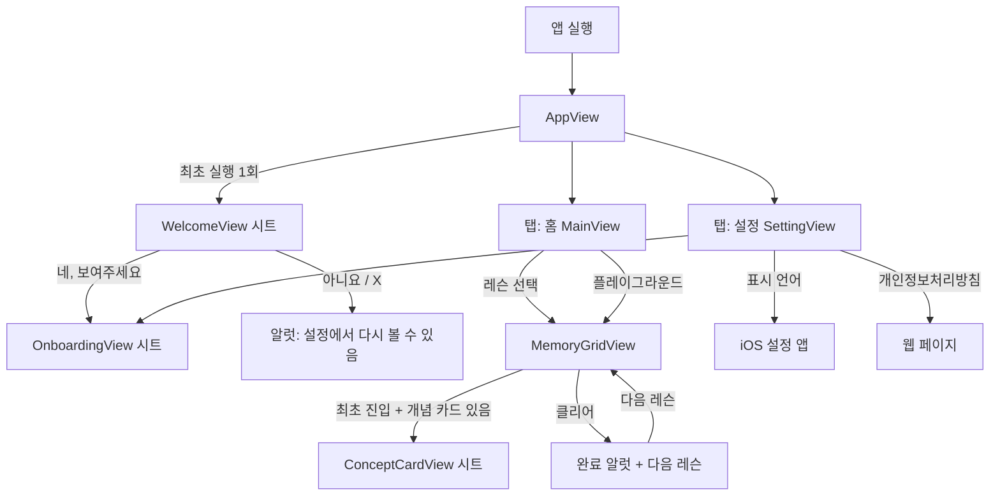
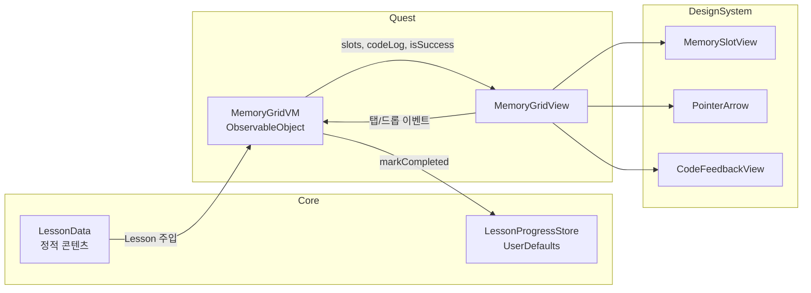

# Pointer Quest 프로젝트 이해 가이드 (1.0.0 기준)
이 문서는 App Store에 출시된 **1.0.0 버전**의 코드를 기준으로, 프로젝트의 구조·기능·설계 결정을 처음부터 따라 읽을 수 있게 정리한 것이다. 이후 `develop`에서 바뀐 내용(1.1.0 작업)은 다루지 않는다.

| 항목 | 값 |
|---|---|
| 기준 태그 | `1.0.0` (커밋 `af733cd`, 2026-09-11) |
| 마케팅 버전 / 빌드 | `1.0` / `1` |
| 플랫폼 | iPhone 전용, iOS 16.0+, 세로 고정 |
| 언어 | Swift 6.0, SwiftUI |
| 프로젝트 생성 | XcodeGen (`project.yml`) |
| 외부 의존성 | 없음 (SPM·CocoaPods 0건) |
| 네트워크 | 없음 (개인정보처리방침 링크를 Safari로 여는 것뿐) |
| 저장소 | `UserDefaults` |
| 지원 언어 | 한국어(소스), 영어 |
| Swift 파일 | 28개, 약 80KB |

> 1.0.0 시점의 코드만 보고 싶다면 작업 트리를 건드리지 않고 `git show 1.0.0:PointerQuest/Scene/Quest/MemoryGridVM.swift`처럼 읽거나, `git worktree add ../pq-1.0.0 1.0.0`으로 별도 폴더에 꺼낼 수 있다.

---

## 1. 이 앱은 무엇을 하는가
C 언어의 **포인터와 메모리**를 손으로 만져 보며 이해하는 학습 시뮬레이터다.

- 화면에 16칸짜리 가상 메모리가 있고, 칸마다 주소(`0x7000`, `0x7004`, …)가 붙어 있다
- 칸을 다른 칸 위로 **드래그 앤 드롭**하면, 드래그한 칸이 포인터가 되어 대상 칸의 주소를 담는다
- 그 조작이 하단 코드 패널에 **실제 C 코드**(`int *p1 = &target;`)로 즉시 번역된다
- 포인터 → 대상 사이에 **화살표**가 그려져 "무엇이 무엇을 가리키는가"를 눈으로 확인한다

이 세 가지(드래그 → C 코드 → 화살표)가 앱의 **3단 학습 루프**이고, 나머지 기능은 모두 이 루프를 감싸는 장치다.

### 1-1. 출발점: 게임에서 학습 도구로
- 원래는 **Swift Student Challenge 2026** 제출용 "게임"(Mission, Level Clear, 잠금 연출)이었다. 태그 `Swift-Student-Challenge-2026`이 그 시점이다
- 수상하지 못한 뒤 App Store 출시로 목표를 바꾸면서 **인터랙티브 학습 도구**로 리포지셔닝했다 (`PROPOSAL.md`)
- 그 과정이 Task 1~28로 쌓였고, 결과물이 1.0.0이다. 각 Task는 `feature/*` 브랜치 → `develop` 병합으로 진행됐다 (Git Flow)

---

## 2. 사용자 관점의 화면 흐름


| 화면 | 파일 | 역할 |
|---|---|---|
| 루트 | [App/AppView.swift](../PointerQuest/App/AppView.swift) | `TabView`(홈/설정) + 최초 실행 시 Welcome 시트 |
| 환영 | [Scene/Welcome/WelcomeView.swift](../PointerQuest/Scene/Welcome/WelcomeView.swift) | 튜토리얼을 볼지 묻는 첫 화면 |
| 튜토리얼 | [Scene/Setting/Onboarding/OnboardingView.swift](../PointerQuest/Scene/Setting/Onboarding/OnboardingView.swift) | 이미지 4장으로 드래그 방법 안내 |
| 홈 | [Scene/Main/MainView.swift](../PointerQuest/Scene/Main/MainView.swift) | 챕터별 레슨 목록 + 플레이그라운드 진입점 |
| 레슨 | [Scene/Quest/MemoryGridView.swift](../PointerQuest/Scene/Quest/MemoryGridView.swift) | 메모리 그리드, 화살표, 코드 패널, 툴바 |
| 개념 카드 | [Scene/Quest/Entity/ConceptCardView.swift](../PointerQuest/Scene/Quest/Entity/ConceptCardView.swift) | 레슨 진입 전 개념 설명 시트 |
| 설정 | [Scene/Setting/SettingView.swift](../PointerQuest/Scene/Setting/SettingView.swift) | 앱 사용법, 표시 언어, 개인정보처리방침 |

### 2-1. 레슨 화면에서 할 수 있는 조작
| 조작 | 처리 함수 | 결과 |
|---|---|---|
| 칸을 다른 칸에 드래그 앤 드롭 | `MemoryGridVM.handleDrop` | 드래그한 칸이 포인터가 되고 대상 주소를 담음 → 클리어 판정 |
| 칸을 한 번 탭 | `MemoryGridVM.handleTap` | 칸의 상태를 C 코드로 설명, 대상 칸 하이라이트 |
| 칸을 두 번 탭 | `MemoryGridVM.dereference` | 역참조(`*p`) — 포인터를 따라가 대상을 하이라이트, 잘못된 역참조는 흔들림 |
| 툴바 `(i)` | `isConceptCardPresented = true` | 개념 카드 다시 열기 |
| 툴바 전구 | `MemoryGridVM.showHint` | 목표 코드를 코드 패널에 표시 (레슨 2만) |
| 툴바 되돌리기 | `MemoryGridVM.reset` | 레슨 초기 상태로 복원 |

---

## 3. 폴더 구조
```text
pointer-quest/
├── project.yml                 # XcodeGen 설정 (빌드 설정의 원본)
├── PointerQuest.xcodeproj/     # project.yml로 생성된 결과물
├── PointerQuest/
│   ├── App/                    # 진입점과 루트 화면
│   │   ├── MyApp.swift         # @main
│   │   ├── AppView.swift       # TabView + Welcome/Onboarding 시트
│   │   └── AppLanguage.swift   # 현재 표시 언어 판별
│   ├── Core/                   # UI와 무관한 모델·저장소
│   │   ├── Lesson.swift        # 레슨 콘텐츠 전체 + 모델 타입들
│   │   ├── MemorySlot.swift    # 메모리 한 칸 모델
│   │   ├── LessonProgressStore.swift  # 완료/개념카드 열람 기록
│   │   └── UIDevice+.swift
│   ├── Scene/                  # 화면 단위
│   │   ├── Main/               # 홈(레슨 목록)
│   │   ├── Quest/              # 레슨 화면 (앱의 핵심)
│   │   │   ├── MemoryGridVM.swift    # ★ 모든 상호작용 로직
│   │   │   ├── MemoryGridView.swift  # ★ 레슨 화면 조립
│   │   │   └── Entity/         # 레슨 화면 전용 하위 뷰
│   │   ├── Setting/            # 설정 + 온보딩
│   │   └── Welcome/            # 첫 실행 환영 화면
│   ├── DesignSystem/           # 화면 간 재사용 컴포넌트·색·이미지
│   │   ├── Component/          # MemorySlotView, PointerArrow, CodeFeedbackView 등
│   │   ├── Animation/          # ShakeEffect
│   │   ├── Colors.xcassets     # 의미 기반 색 자산 (Main, Green, Red …)
│   │   └── Images.xcassets
│   ├── Localizable.xcstrings   # 문자열 카탈로그 (ko 소스, en 번역, 98개 키)
│   └── Info.plist
├── docs/                       # 스토어 메타데이터, 방침·지원 페이지, 스크린샷 프레임
├── PROPOSAL.md                 # 왜 게임 → 학습 도구로 바꿨는가
├── PLAN.md                     # Task별 설계 배경·결정
├── PROGRESS.md                 # Task별 구현 기록
├── TODO.md                     # 체크리스트
├── HANDOFF.md                  # 세션 간 인수인계
├── STYLE_GUIDE.md              # SwiftUI 코딩 스타일
└── VISUAL_LANGUAGE.md          # 메모리·포인터를 화면에 그리는 규칙
```

**레이어 규칙**: `Core`는 SwiftUI를 import하지 않는다(`Foundation`/`UIKit`만). `DesignSystem`은 특정 화면을 모른다. `Scene`이 둘을 조합한다.

---

## 4. 아키텍처: 데이터가 로직을 결정한다


구조는 **MVVM**이다. 핵심은 Task 1에서 도입한 **블루프린트(Blueprint) 방식**이다.

- **이전(SSC 버전)**: 레슨마다 초기 배치와 클리어 조건이 VM 안의 `switch level { case 1: … }`에 하드코딩되어, 레슨을 추가할 때마다 로직을 고쳐야 했다
- **1.0.0**: 레슨은 **데이터**(`LessonBlueprint`)로 선언하고, VM은 그 데이터를 해석하는 **범용 엔진**이다. 새 레슨은 `Lesson.swift`에 데이터만 추가하면 된다

### 4-1. 모델 타입 관계
```text
LessonData (정적 저장소)
 ├── chapters: [Chapter]
 │     └── lessons: [Lesson]
 │            ├── title / description / iconName / summary
 │            ├── conceptCard: ConceptCard?  ── sentences + diagram(enum)
 │            └── blueprint: LessonBlueprint
 │                   ├── seeds: [SlotSeed]         ← 초기 배치
 │                   ├── successCondition          ← 클리어 판정 규칙
 │                   ├── initialCodeLog
 │                   └── hintCode?
 ├── lessons (= chapters.flatMap(\.lessons))
 └── sandboxLesson (id 100, 챕터 밖)
```

| 타입 | 위치 | 설명 |
|---|---|---|
| `Lesson` | [Core/Lesson.swift](../PointerQuest/Core/Lesson.swift) | 레슨 하나. `Hashable`을 **`id`로만** 직접 구현 (`LocalizedStringResource`가 자동 합성 대상이 아니기 때문) |
| `Chapter` | 같은 파일 | 레슨 묶음. 1.0.0에는 챕터 1만 실제 콘텐츠, 2~5는 Coming Soon |
| `LessonBlueprint` | 같은 파일 | "어떻게 시작하고 언제 끝나는가"만 담는 데이터 |
| `SlotSeed` | 같은 파일 | "몇 번 칸을 어떤 상태로 둘 것인가" |
| `SuccessCondition` | 같은 파일 | 클리어 판정 규칙 enum (아래 표) |
| `ConceptCard` | 같은 파일 | 진입 전 설명 문장 + 도식 종류 |
| `MemorySlot` | [Core/MemorySlot.swift](../PointerQuest/Core/MemorySlot.swift) | 런타임 메모리 한 칸의 상태 |

### 4-2. 클리어 조건 (`SuccessCondition`)
| 케이스 | 의미 | 쓰는 레슨 |
|---|---|---|
| `.inspectedAll(indices:)` | 지정한 칸을 모두 탭해 확인 | 레슨 0 (관찰형) |
| `.anyPointerPointsTo(index:)` | 어떤 포인터든 그 칸을 가리키면 | 레슨 1, 2 |
| `.chain(indices:)` | 칸들이 순서대로 서로를 가리키면 | 레슨 3 |
| `.sandbox` | 판정 없음 | 플레이그라운드, Coming Soon |

### 4-3. 1.0.0의 레슨 콘텐츠
| id | 제목 | 초기 배치 (칸 번호: 내용) | 클리어 조건 | 배우는 것 |
|---|---|---|---|---|
| 0 | 변수와 메모리 | 1: `age=20`, 6: `score=100`, 10: `level=7` | 세 칸 모두 탭 | 모든 칸에는 주소가 있다 |
| 1 | 주소가 중요한 이유 | 3: 값 100, 8: 빈 포인터 | 3번을 가리킴 | 포인터는 주소를 담는 상자 |
| 2 | 징검다리 포인터 | 7: 값 777(참조됨), 5: 7을 가리키는 포인터, 14: 빈 포인터 | 5번(포인터)을 가리킴 | 이중 포인터 `int **` |
| 3 | 체인 연결 | 15: `treasure=999`, 11: `nodeB`, 5: `nodeA`, 0: `start` | 0→5→11→15 체인 | 연결 리스트의 원형 |
| 4~7 | 이중 포인터 심화 외 3개 | — | — | Coming Soon (진입 불가) |
| 100 | 플레이그라운드 | 빈 칸 16개 | 없음 | 자유 탐험 |

- 플레이그라운드 id가 100인 이유: `MainView`가 `navigationDestination(for: Lesson.self)`로 **값 기반 내비게이션**을 하고, `Lesson`은 `id`로 같음을 판단한다. 레슨 0을 추가하면서 원래 id 0이던 샌드박스가 실제 레슨과 겹쳐 예약 번호대로 옮겼다

---

## 5. 핵심 엔진: `MemoryGridVM`
[Scene/Quest/MemoryGridVM.swift](../PointerQuest/Scene/Quest/MemoryGridVM.swift)는 앱 로직의 거의 전부(약 470줄)다. `@MainActor` + `ObservableObject`이고, 화면에 노출하는 상태는 네 개뿐이다.

| `@Published` | 의미 |
|---|---|
| `slots: [MemorySlot]` | 16칸의 현재 상태 (`private(set)`) |
| `codeLog: LocalizedStringResource` | 코드 패널에 보여줄 C 코드 |
| `currentLesson: Lesson` | 진행 중인 레슨 (`private(set)`) |
| `isSuccess: Bool` | 클리어 여부 → 완료 알럿 바인딩 |

### 5-1. 레슨 시작: `setupLevel`
```swift
slots = (0 ..< 16).map {
  MemorySlot(
    address: String(format: "0x%04X", 0x7000 + ($0 * 4)),
    value: nil,
    type: .empty
  )
}
```
- 16칸을 빈 칸으로 만든 뒤, `blueprint.seeds`를 순회하며 지정된 칸만 덮어쓴다
- 주소가 **4씩** 증가하는 이유: C의 `int`는 보통 **4바이트**다. 연속된 `int` 변수가 메모리에 놓이는 모습을 흉내 낸 것이다 (`0x7000`, `0x7004`, `0x7008`, …, `0x703C`)
- `seed.pointingToIndex`는 인덱스로 선언하지만, 슬롯에는 **주소 문자열**(`pointingTo`)로 저장한다. 실제 포인터가 "몇 번째"가 아니라 "어느 주소"를 담는 것과 같다

### 5-2. 드래그 앤 드롭: `handleDrop`
```mermaid
sequenceDiagram
  participant U as 사용자
  participant MI as MemoryItem
  participant VM as MemoryGridVM
  participant LP as LessonProgressStore

  U->>MI: 칸 A를 칸 B 위에 드롭
  MI->>MI: .dropDestination — A == B면 무시
  MI->>VM: handleDrop(source: A주소, destination: B주소)
  VM->>VM: A.type = .pointer, A.value = nil, A.pointingTo = B주소
  alt B가 빈 칸
    VM->>VM: B에 1~99 랜덤 값 자동 초기화
  else B가 이미 참조됨(레슨 2)
    VM->>VM: "이미 있는 포인터를 가리켜 보세요" 안내
  else 그 외
    VM->>VM: int *pA = &B; 생성
  end
  VM->>VM: highlightSlot(A) (1초 후 해제)
  VM->>VM: checkSuccess()
  VM-->>LP: 조건 충족 시 markCompleted(lessonId)
```
- 드래그 데이터는 **주소 문자열**이다. `MemoryItem`이 `.draggable(slot.address)`로 내보내고 `.dropDestination(for: String.self)`로 받는다 (iOS 16의 `Transferable` API)
- 드래그한 칸이 포인터가 된다는 점이 중요하다. C의 `source = &destination;`과 같은 방향이다

### 5-3. 탭과 역참조: `handleTap` / `dereference`
- **한 번 탭**: 칸이 포인터면 대상까지 따라가 상황에 맞는 C 코드를 만든다
  - 대상이 값 → `int *p1 = &target;`
  - 대상이 포인터 → `int **p2 = &ptr1;` (이중 포인터)
  - 체인이 3단 이상 → 타입을 쓰지 않고 `// start -> nodeA -> nodeB -> treasure` 경로와 "몇 번 거치는지"를 주석으로 설명 (Task 28)
  - 대상이 빈 칸 → 초기화되지 않은 변수 경고
- **두 번 탭**: `printf("%d", *p1);`처럼 역참조를 보여준다. 값 칸이나 아무 곳도 가리키지 않는 포인터를 역참조하면 실제 C에서도 오류이므로 **빨간 배경 + 흔들림**을 준다. 빈 칸은 실수가 아니므로 아무 일도 하지 않는다
- `MemoryGridView`에서 `.onTapGesture`와 `.simultaneousGesture(TapGesture(count: 2))`를 함께 걸었기 때문에 더블 탭 시 `handleTap`도 같이 불린다. `dereference`가 빈 칸에서 `codeLog`를 건드리지 않는 이유가 이것이다

### 5-4. 변수 이름 붙이기 — 코드가 컴파일 가능하게
코드 패널에 찍히는 C는 **실제로 컴파일되는 코드**여야 한다는 원칙이 있다. 이름 결정은 `resolveVariableName(for:fallback:)` 하나로 모인다.

1. 칸에 이미 이름이 있으면 재사용한다 (한 번 붙은 이름은 리셋 전까지 바뀌지 않는다)
2. 레슨이 `SlotSeed.variableName`으로 선언했다면 그 이름을 쓴다 (`start`, `treasure`)
3. 아니면 `fallback`을 쓴다 (`target`, `p1`, `p2`, …)
4. 어느 경우든 `uniqueName`을 거쳐 **다른 칸과 겹치지 않게** 한다 (`target`, `target2`, …)

- 겹침을 막는 이유: 겹치면 `int *target = &target;` 같은, 자기 자신의 주소를 담는 컴파일 불가 코드가 나온다
- 이름은 `MemorySlot.variableName`에 저장되어 **그리드 칸 라벨과 코드 패널이 같은 이름**을 쓴다 (Task 11)

### 5-5. 체인 따라가기: `pointerDepth` / `chainNames`
```swift
while slots[current].type == .pointer {
  guard visited.insert(current).inserted else { break }  // 순환 방지
  depth += 1
  ...
}
```
- 포인터를 몇 번 거쳐야 값에 닿는지 세어 `*` 개수를 정한다 (`int`, `int *`, `int **`)
- 플레이그라운드에서는 A→B→A 같은 **순환**을 만들 수 있으므로 `visited` 집합으로 무한 루프를 막는다. 연결 리스트의 사이클 탐지와 같은 문제다

### 5-6. 클리어 판정: `checkSuccess`
```swift
case .chain(let indices):
  let isConnected = zip(indices, indices.dropFirst()).allSatisfy { current, next in
    slots[current].pointingTo == slots[next].address
  }
```
- `zip(a, a.dropFirst())`는 `[0,5,11,15]`를 `(0,5) (5,11) (11,15)` 쌍으로 만든다. 인접한 쌍이 모두 연결되어 있으면 체인 완성이다
- 충족되면 `finishLevel()` → `isSuccess = true` + `LessonProgressStore.shared.markCompleted`

### 5-7. 일시적 시각 효과
- `highlightSlot`(노랑, 1초), `triggerError`(빨강+흔들림, 0.5초)는 상태 플래그를 켠 뒤 `DispatchQueue.main.asyncAfter`로 끈다
- 뷰는 플래그만 보고 그린다. **애니메이션 타이밍도 VM이 소유**하는 구조다

---

## 6. 화면 조립: `MemoryGridView`와 화살표
[Scene/Quest/MemoryGridView.swift](../PointerQuest/Scene/Quest/MemoryGridView.swift)

```text
ScrollView
 └── VStack
      ├── LessonHeaderView          (레슨 설명)
      └── LazyVGrid(16칸)
           ├── MemoryItem × 16      (MemorySlotView + 드래그/드롭)
           └── overlayPreferenceValue
                ├── ArrowDrawLayer  (포인터 화살표)
                └── GridInteractionHintOverlay (레슨 1 최초 1회)
.safeAreaInset(edge: .bottom) → CodeFeedbackView (코드 패널)
.toolbar → (i) / 전구 / 되돌리기
.alert → 레슨 완료
.sheet → ConceptCardView
```

- 그리드는 `GridItem(.adaptive(minimum: 100))`이라 **열 수가 화면 폭으로 정해진다**. 모델은 "16칸"이지 "4×4"가 아니며, 일반 iPhone에서는 3열로 보인다

### 6-1. 화살표를 그리는 방법 (Anchor Preference)
화살표의 시작·끝 좌표는 칸이 **실제로 배치된 위치**에서 얻어야 한다. SwiftUI에는 자식의 위치를 부모로 올려 보내는 장치가 있다.

1. 각 칸이 `.anchorPreference(key: BoundsPreferenceKey.self, value: .bounds) { [slot.id: anchor] }`로 자기 영역을 **Anchor**로 올린다
2. `BoundsPreferenceKey.reduce`가 16개의 딕셔너리를 하나로 합친다
3. 그리드의 `.overlayPreferenceValue`가 합쳐진 값을 받고, `GeometryReader`의 `proxy[anchor]`로 **오버레이 좌표계의 `CGRect`**로 변환한다
4. `ArrowDrawLayer`가 포인터 칸마다 시작 칸 중심 → 대상 칸 중심으로 `PointerArrow`를 그린다

- `Anchor`는 "어느 좌표계 기준인지 아직 정해지지 않은 위치"다. 받는 쪽 `GeometryProxy`에서 풀어야 비로소 그 뷰 기준 좌표가 된다. 그래서 화면 회전·스크롤과 무관하게 정확하다
- `ArrowDrawLayer`는 `.allowsHitTesting(false)` — 화살표가 드래그를 가로막지 않는다
- `Arrow` Shape는 `animatableData`를 `AnimatablePair`로 구현해 **시작점·끝점이 바뀔 때 선이 스프링으로 움직인다**
- 같은 기법을 `ConceptCardView`의 도식에서도 그대로 재사용한다

### 6-2. 레슨 간 이동과 `@StateObject`
```swift
.navigationDestination(for: Lesson.self) { lesson in
  MemoryGridView(lesson: lesson, path: $path)
    .id(lesson.id)
}
```
- "다음 레슨"은 새 화면을 쌓지 않고 `path`의 **마지막 원소를 교체**한다. 그래서 몇 개를 이어 풀어도 뒤로가기 한 번이면 목록으로 돌아온다
- 그런데 같은 자리의 뷰는 SwiftUI가 같은 뷰로 보고 `@StateObject`(VM)를 **유지**한다 → `init`이 다시 불려도 이전 레슨 VM이 남는다
- `.id(lesson.id)`로 뷰의 **정체성**을 바꿔 VM을 새로 만들게 한다. SwiftUI에서 "뷰는 매번 재생성되지만 상태 저장소는 정체성에 묶여 있다"는 원리를 보여주는 대표 사례다

---

## 7. 코드 패널: `CodeFeedbackView` + `CCodeHighlighter`
- [DesignSystem/Component/CodeFeedbackView.swift](../PointerQuest/DesignSystem/Component/CodeFeedbackView.swift): 항상 어두운 터미널 스타일 박스
- [DesignSystem/Component/CCodeHighlighter.swift](../PointerQuest/DesignSystem/Component/CCodeHighlighter.swift): 한 글자씩 훑으며 키워드·문자열·주석을 색칠해 `AttributedString`을 만드는 간단한 토크나이저

### 왜 직접 색칠하는가 (실제로 있었던 버그)
- `codeLog`를 `LocalizedStringResource`로 바꾸자 `Text`가 문자열을 **마크다운으로 파싱**하기 시작했다
- `int *p = &a;`, `int **pp`의 `*`가 마크다운 강조 기호로 해석되어 **일부 텍스트가 사라졌다**
- 해결: `String(localized:)`로 먼저 번역 문자열을 얻은 뒤, 마크다운 파서를 거치지 않는 `AttributedString`으로 직접 색을 입혀 `Text`에 넘긴다

---

## 8. 상태 저장
앱이 기기에 남기는 것은 **`UserDefaults` 키 네 개**가 전부다.

| 키 | 저장 위치 | 내용 |
|---|---|---|
| `completedLessonIds` | `LessonProgressStore` | 완료한 레슨 id 배열 → 목록의 체크마크 |
| `seenConceptCardLessonIds` | `LessonProgressStore` | 개념 카드를 본 레슨 → 최초 진입 시에만 자동 표시 |
| `isOnboardingWatched` | `AppView` `@AppStorage` | Welcome 시트를 띄웠는지 |
| `hasSeenGridHint` | `MemoryGridView` `@AppStorage` | 레슨 1 드래그 힌트를 봤는지 |

- [Core/LessonProgressStore.swift](../PointerQuest/Core/LessonProgressStore.swift)는 `@MainActor` **싱글턴** `ObservableObject`다. 메모리에는 `Set<Int>`로 들고(조회 O(1)), 디스크에는 `Array`로 쓴다 (`UserDefaults`는 `Set`을 저장하지 못한다)
- `LessonRow`가 `@ObservedObject`로 구독하므로, 레슨을 깨고 돌아오면 체크마크가 바로 갱신된다
- `markCompleted`는 `Set.insert(_:).inserted`로 **이미 있으면 쓰지 않는다** — 불필요한 디스크 쓰기를 막는다

---

## 9. 로컬라이제이션
- 소스 언어는 **한국어**, 영어는 번역이다 (Task 7에서 영어 → 한국어로 소스 전환)
- 모델의 텍스트 필드는 `String`이 아니라 `LocalizedStringResource`다. 그래서 `Lesson.swift`에 한국어 리터럴을 쓰면 그대로 번역 키가 된다
- 코드 패널의 C 코드 **주석까지** 번역 대상이다. `codeLog`의 문자열 보간(`"int \(name) = \(value);"`)도 카탈로그에서 `%@`/`%lld` 자리표시자로 관리된다
- `project.yml`의 `SWIFT_EMIT_LOC_STRINGS: YES`가 없으면 소스에서 키가 추출되지 않아 카탈로그 동기화가 **조용히 멈춘다**
- 언어 변경은 앱 안에서 하지 않고 **iOS 설정 앱의 앱별 언어**로 보낸다 (`UIPrefersShowingLanguageSettings: true`, `UIApplication.openSettingsURLString`). 현재 언어는 [App/AppLanguage.swift](../PointerQuest/App/AppLanguage.swift)가 `Bundle.main.preferredLocalizations`로 판별한다
- 번역이 필요 없는 문자열은 `Text(verbatim:)`을 써서 카탈로그에 키가 생기지 않게 한다 (예: 완료 알럿의 `"\n\n"`)

---

## 10. 디자인 시스템과 비주얼 언어
`VISUAL_LANGUAGE.md`가 "메모리와 포인터를 화면에 어떻게 그리는가"의 계약서다. 핵심만 추리면 다음과 같다.

### 10-1. 두 축 분리
| 축 | 뜻 | 시각 채널 |
|---|---|---|
| 종류(kind) | 값 / 포인터 / 빈 칸 — 잘 안 변함 | **테두리 색** + 내용 표기 |
| 상태(state) | 에러 / 강조 / 참조됨 — 수시로 변함 | **배경 색(30%)** + 모션 + 배지 |

같은 색을 두 축에 걸쳐 쓰지 않는다. 그래야 학습자가 색을 신뢰할 수 있다.

### 10-2. 색 자산의 의미
| 자산 | 의미 |
|---|---|
| `Main` | 포인터(테두리, 화살표, 변수명, 배지) + 앱 강조색 |
| `Green` | 값 + 완료 체크마크 |
| `Red` | 에러 (상태) |
| `Yellow` | 강조 (상태) |
| `LightBlue`, `Deco`, `LightDeco` | 장식 (그라데이션, 플레이그라운드) |
| `CodeKeyword` | 코드 패널 전용 (에디터 팔레트는 별도 축) |
| `LaunchBackground` | 런치스크린 (첫 화면 배경과 같은 값) |

- 의미를 가진 색은 `Color(.main)`처럼 **Xcode가 자산에서 생성한 심볼**로 쓴다. 직접 쓴 시스템 색(`.white`, `.gray`, 코드 패널의 `.green`/`.orange`, 배경 `Color(white: 0.15)`)은 의미 축이 아닌 글자색·장식·에디터 팔레트에만 있다
- 색에만 의존하지 않는다: 값은 큰 둥근 숫자, 포인터는 `→ 0x700C` 표기, 에러는 흔들림, 참조는 `link` 심볼

### 10-3. 재사용 컴포넌트
| 컴포넌트 | 역할 | 재사용처 |
|---|---|---|
| `MemorySlotView` | 칸 하나를 그리는 **표시 전용** 뷰 | 그리드(`MemoryItem`이 감쌈), 개념 카드 도식 |
| `PointerArrow` | 선(`Arrow`) + 머리(`Triangle`) | `ArrowDrawLayer`, 개념 카드 도식 |
| `CodeFeedbackView` | 코드 패널 | 레슨 화면 |
| `ShakeEffect` | `GeometryEffect`로 `sin` 기반 좌우 흔들림 | `MemorySlotView` 에러 |

- `MemoryItem`(상호작용) / `MemorySlotView`(표시)로 나눈 덕분에 개념 카드가 **그리드와 똑같은 표기**로 도식을 조립한다. 새 이미지를 만들지 않는다 (`VISUAL_LANGUAGE.md` §8)
- 참고: `VISUAL_LANGUAGE.md` §3은 `Arrow`를 "곡선"이라 적었지만, 1.0.0의 `Arrow.path`는 `addLine`으로 **직선**을 그린다

---

## 11. 빌드 설정에 숨은 결정들
`project.yml`의 주석에 결정 이유가 남아 있다. 코드만 봐서는 보이지 않는 것들이다.

| 설정 | 이유 |
|---|---|
| `ASSETCATALOG_COMPILER_GLOBAL_ACCENT_COLOR_NAME: Main` | `.tint`는 시트로 전파되지 않아 온보딩·개념 카드가 시스템 파랑으로 남았다. 빌드 설정으로 지정하면 시트·알럿까지 덮인다 (Task 26) |
| `CFBundleDisplayName: Pointer Quest` | `CFBundleName`은 `$(PRODUCT_NAME)`이라 띄어쓰기 없는 `PointerQuest`가 홈 화면에 뜬다 |
| `UILaunchScreen.UIColorName: LaunchBackground` | 기본 흰색에서 목록 배경(#F2F2F7)으로 넘어갈 때 색이 튀는 것을 막는다 (Task 25) |
| `SUPPORTS_MACCATALYST` 등 3개 `NO` | `TARGETED_DEVICE_FAMILY: 1`만으로는 Mac·Vision Pro 스토어에 함께 올라간다 (Task 21) |
| `ITSAppUsesNonExemptEncryption: false` | 업로드마다 수출 규정 질문을 받지 않기 위해 |
| `SWIFT_EMIT_LOC_STRINGS: YES` | 로컬라이즈 키 추출 (9장 참고) |
| 타깃 `DEVELOPMENT_TEAM: 6S73VSPTS8` | 프로젝트 기본값을 타깃이 덮어쓴다. 서명에 실제 쓰이는 값은 이쪽 |

---

## 12. 근본 원리: 앱의 모델 vs 실제 C 메모리
앱은 학습용으로 단순화한 **notional machine**이다. 무엇을 흉내 냈고 무엇을 생략했는지 알면 코드가 더 잘 읽힌다.

### 12-1. 포인터의 정의
"포인터는 데이터가 저장된 곳의 주소값"은 방향은 맞지만, 그것만으로는 이중 포인터(레슨 2)를 설명할 수 없다. 다듬은 정의는 다음과 같다.

> **포인터는 다른 데이터가 있는 위치의 주소를 값으로 저장하는 변수이며, 그 주소에 어떤 타입의 데이터가 있는지도 함께 안다.**

#### (1) 주소값 자체가 아니라, 주소값을 담는 변수다
```c
int age = 20;        // 0x7004에 20이 저장됨
int *p  = &age;      // 0x7020에 0x7004가 저장됨
```
```text
주소      내용         이름
0x7004   [   20   ]   age
0x7020   [ 0x7004 ]   p      ← p도 메모리 한 칸을 차지한다
```
- `p`는 자기 칸(`0x7020`)을 가지고, 그 칸에 담긴 값이 주소 `0x7004`다
- 포인터에도 주소가 있으므로 `&p`가 존재하고, 그것을 담으면 `int **pp = &p;`(이중 포인터)가 된다
- 앱도 같은 구조다. 포인터 칸도 `MemorySlot`이라 자기 `address`가 있고, 대상의 주소는 `pointingTo`에 따로 담는다
- 일상에서는 "포인터"가 값(주소)과 변수 두 뜻으로 섞여 쓰인다. 헷갈리면 "포인터 변수"와 "주소값"으로 나눠 부른다

#### (2) 주소와 함께 타입을 안다
주소는 "몇 번째 바이트부터"라는 시작 위치만 알려준다. 거기서 몇 바이트를 어떻게 해석할지는 타입이 정한다.

| 선언 | `*p`로 읽는 범위 | `p + 1`의 실제 이동 |
|---|---|---|
| `char *p` | 1바이트 | +1 |
| `int *p` | 4바이트를 정수로 | +4 |
| `double *p` | 8바이트를 실수로 | +8 |

- 앱의 `0x7000 + index * 4`는 칸 하나를 `int` 하나(4바이트)로 본 것이다
- `p + 1`의 이동량이 타입마다 다르다는 성질이 챕터 3(배열과 포인터 연산)의 주제다
- C 표준(N3220 §6.2.5 Types)도 포인터를 주소가 아니라 "참조되는 타입(referenced type)으로부터 파생된 **타입**"으로 먼저 정의한다

#### (3) 그 주소는 RAM의 물리 주소가 아니다
```text
int *p = 0x7ffe...   (가상 주소: 프로세스마다 독립된 주소 공간)
        │
        ▼  MMU + 페이지 테이블이 변환
RAM의 실제 위치      (물리 주소: 프로그램은 알 수 없음)
```
- 현대 OS에서 프로그램이 보는 주소는 **가상 주소**다. 두 프로그램이 같은 주소 값을 써도 RAM의 서로 다른 곳을 가리킨다
- 그 데이터가 RAM이 아니라 디스크(스왑)에 내려가 있을 수도 있다. 변환은 OS와 하드웨어가 처리한다
- 따라서 "주기억장치의 주소"보다 "**프로그램의 메모리 공간 안의 주소**"가 정확하다

#### (4) 항상 유효한 곳을 가리키지는 않는다
- `NULL`(아무것도 가리키지 않음)일 수도, 초기화하지 않아 임의의 주소를 담고 있을 수도 있다
- 앱에서 아무 곳도 가리키지 않는 포인터를 더블 탭하면 빨갛게 흔들리는 것이 이 경우다 (`dereference`의 오류 분기)
- 데이터가 아니라 함수의 주소를 담는 함수 포인터도 있다

#### (5) `&`와 `*`는 반대 연산이다
- `&`는 변수에서 주소를 꺼내고, `*`는 주소를 따라가 값을 읽는다
- 그래서 `*&age == age`이고, `p == &age`이면 `*p == age`다

| 개념 | C | 앱에서 확인하는 곳 |
|---|---|---|
| 모든 칸에는 주소가 있다 | `&age` | 레슨 0, 칸 왼쪽 위의 `0x7004` |
| 포인터는 주소를 담는 칸 | `int *p = &age;` | 레슨 1, 칸 안의 `→ 0x700C` |
| 포인터 칸도 자기 주소가 있다 | `int **pp = &p;` | 레슨 2 |
| 역참조는 주소를 따라가 읽는 것 | `*p` | 칸 더블 탭 |
| 따라가는 횟수만큼 `*`가 붙는다 | `int **`, `int ***` | 레슨 3, `pointerDepth` |

### 12-2. 앱의 모델과 실제 C의 대응
| 실제 C | 앱의 모델 | 코드 |
|---|---|---|
| 메모리는 바이트 단위 주소를 가진 연속 공간 | 16칸, 칸마다 주소 | `setupLevel` |
| `int`는 4바이트 → 다음 변수는 주소 +4 | `0x7000 + index * 4` | `String(format: "0x%04X", …)` |
| 포인터 변수도 메모리에 있고 자기 주소가 있다 | 포인터 칸도 일반 칸과 같은 `MemorySlot` | `type: .pointer` |
| 포인터의 값 = 다른 변수의 주소 | `pointingTo: String?` (주소 문자열) | `handleDrop` |
| `&a` 주소 연산자 | 드롭 대상의 주소를 읽음 | `destinationAddress` |
| `*p` 역참조 | 더블 탭으로 대상 하이라이트 | `dereference` |
| `int **pp` — `*` 개수 = 따라가는 횟수 | 체인을 따라가며 센 깊이 | `pointerDepth` |
| 초기화 안 된 변수 = 쓰레기 값 | 빈 칸에 연결하면 1~99 랜덤 값 | `Int.random(in: 1...99)` |
| 연결 리스트는 구조체로 묶어 `*`가 늘지 않음 | 칸이 주소만 담아 `*`가 늘어남 → 주석으로 설명 | Task 28 (1.x에서 다룰 예정) |

### 12-3. Swift 쪽에서 볼 만한 메모리 관점
- `MemorySlot`은 **struct**(값 타입)이고 `slots`는 배열이다. `slots[i].type = .pointer`는 배열 안의 값을 직접 바꾸며, `@Published`가 배열 전체의 변경을 감지해 뷰를 갱신한다
- `MemoryGridVM`·`LessonProgressStore`는 **class**(참조 타입)다. 여러 뷰가 **같은 인스턴스**를 공유해야 하기 때문이다 (`MemoryItem`, `ArrowDrawLayer`가 같은 VM을 `@ObservedObject`로 받음)
- `MemorySlot.id = UUID()`는 생성 시마다 새로 만들어진다. 리셋하면 16칸이 새 id로 다시 생기므로 `ForEach`가 칸을 새 뷰로 인식한다
- `highlightSlot`의 `asyncAfter` 클로저는 `self`를 강하게 잡는다. 화면이 닫혀도 최대 1초간 VM이 살아 있다가 해제된다 — 짧고 유한해서 문제가 되지 않는다
- `BoundsPreferenceKey.defaultValue`의 `nonisolated(unsafe)`는 Swift 6의 엄격한 동시성 검사에서 전역 가변 상태 경고를 피하기 위한 표기다

### 12-4. C 공식 자료를 찾는 곳
C는 특정 회사나 재단이 소유한 언어가 아니라 국제 표준(ISO/IEC 9899)이다. 그래서 swift.org 같은 단일 본진이 없고, 역할별로 나뉜다.

| 사이트 | 역할 | 언제 보나 |
|---|---|---|
| [c-language.org](https://www.c-language.org/) | 공식 언어 소개 사이트. WG14 제72차 회의에서 N3408 검토 후 만장일치로 승인 | 표준 개정 이력(K&R → C23)과 자료 링크를 볼 때 |
| [open-std.org/jtc1/sc22/wg14](https://www.open-std.org/jtc1/sc22/wg14/) | 표준위원회(WG14) 사이트. 제안 문서, 회의록, 초안 | 표준 문구를 직접 확인할 때 |
| ISO | 정식 표준 문서 판매처 (ISO/IEC 9899:2024 = C23) | 거의 볼 일 없음 |
| [cppreference (C)](https://en.cppreference.com/w/c) | 표준을 읽기 쉽게 정리한 비공식 레퍼런스 | 평소 공부할 때 |

- 정식 ISO 표준은 유료지만, 최종본과 내용이 거의 같은 위원회 초안은 무료로 공개된다. C23은 **N3220**이 사실상 표준 대신 읽는 문서다

---

## 13. 개발 이력 한눈에 보기
| 단계 | Task | 주요 내용 | 대표 브랜치 |
|---|---|---|---|
| SSC 제출 | — | 게임 포맷, 레슨 3개 하드코딩 | 태그 `Swift-Student-Challenge-2026` |
| 아키텍처 전환 | 1~8 | 블루프린트 VM, 학습 톤 카피, 샌드박스, 진행 저장, 챕터 placeholder, 세로 리스트, 한국어 소스 | `feature/blueprint-driven-vm` 외 |
| 그리드 UX | 9~11 | 마크다운 버그 수정, 레슨 1 드래그 힌트, Lock 제거 → 참조 배지, 칸에 변수명 표시 | `feature/lesson-grid-ux-improvements` 외 |
| 정리 | 12~14 | 스타일 가이드 정리, 언어 설정 링크, `VISUAL_LANGUAGE.md` 확정 | `feature/swiftui-style-cleanup` 외 |
| 학습 효과 | 15~19 | 레슨 0, 개념 카드, 완료 요약, 목록 설명 정리 | `feature/lesson-concept-cards` 외 |
| 출시 준비 | 20~28 | 팔레트·아이콘 재제작, iPhone 전용, 영어 점검, 강조색, 방침·지원 페이지, 스크린샷, 런치스크린, 코드 패널 C 정확성, 체인 깊이 표기 | `feature/branding-rework` 외 |
| 출시 | — | `develop` → `master` 병합, 태그 `1.0.0` | `af733cd` |

설계 배경은 `PLAN.md`, 구현 기록은 `PROGRESS.md`에서 Task 번호로 찾으면 된다.

---

## 14. 코드를 읽는 추천 순서
1. [Core/MemorySlot.swift](../PointerQuest/Core/MemorySlot.swift) — 칸 하나가 가진 상태 (40줄)
2. [Core/Lesson.swift](../PointerQuest/Core/Lesson.swift) — 아래쪽 타입 정의를 먼저, 위쪽 `LessonData` 콘텐츠를 나중에
3. [Scene/Quest/MemoryGridVM.swift](../PointerQuest/Scene/Quest/MemoryGridVM.swift) — `setupLevel` → `handleDrop` → `checkSuccess` → `handleTap` 순
4. [Scene/Quest/MemoryGridView.swift](../PointerQuest/Scene/Quest/MemoryGridView.swift) + `Entity/` — 화면 조립과 화살표
5. [DesignSystem/Component/MemorySlotView.swift](../PointerQuest/DesignSystem/Component/MemorySlotView.swift) — 비주얼 언어가 코드로 어떻게 구현됐는지
6. [Scene/Main/MainView.swift](../PointerQuest/Scene/Main/MainView.swift) — 내비게이션과 `.id(lesson.id)`
7. [App/AppView.swift](../PointerQuest/App/AppView.swift) → Welcome/Onboarding/Setting — 주변 화면
8. `project.yml` — 빌드 설정의 이유

### 직접 손대 보며 이해하기
- `Lesson.swift`에 `.anyPointerPointsTo`를 쓰는 레슨을 하나 추가해 본다. VM을 건드리지 않고 동작하면 블루프린트 구조를 이해한 것이다
- `setupLevel`의 `* 4`를 `* 8`로 바꿔 본다. 주소가 `double`/64비트 포인터 크기처럼 8씩 늘어난다
- `MainView`의 `.id(lesson.id)`를 지우고 "다음 레슨"을 눌러 본다. 레슨 제목은 그대로이고 칸도 바뀌지 않는 현상을 확인할 수 있다
